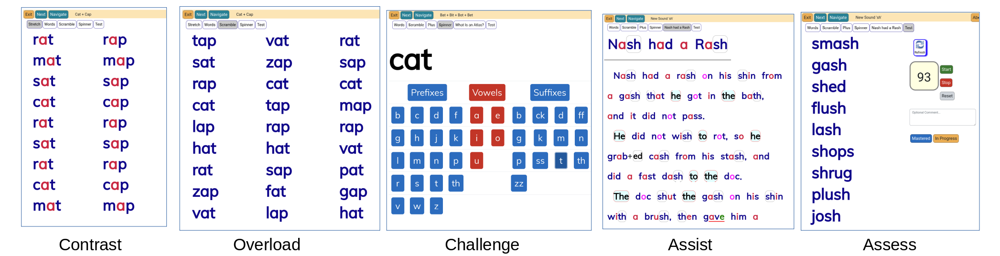

## BLENDING - for Older Students with Severe Reading Deficits

***BLENDING*** provides progressive phonological drills and decodable texts. It is a complete program for tutor-led *intensive* interventions for older students still reading at grade-1 or -2 level.

It requires no special skills and can be used by EAs, parents, or even student volunteers.  The software provides hints for the tutors, progress monitoring, record-keeping, and continual formative assessments.

Most middle-school classrooms have at least one student who cannot make sense of a grade-2 chapter book; they have stalled and will make no further progress without intensive intervention.  The research is clear: almost all students become strong, competent readers with proper instruction. This program specifically addresses the needs of older students.

An intensive intervention prescribes one-on-one tutoring for at least an hour per day, ideally two hours, at least five days a week. This program requires about ten weeks of DAILY practice - about 20 minutes per day for drills, plus increasing reading and writing practice.  By the end, the student will be prepared to read a grade-3 chapterbook (such as Goosebumps) independently.

Unsure if BLENDING is appropriate?  Try it for 20 minutes with your student.  An online version is available FREE at [Community Reading](https://www.communityreading.org/moodle/).

Older Students

Older students are not ‘emerging readers’ paused as if caught in amber.  They have continued to develop along a bumpy off-road track.  They have reading superpowers like larger vocabularies,  tenacious memory, and world knowledge.

But they also have severe deficits that are not faced by emerging readers.

Some are unable to read the simplest texts, and barely know the common sounds of the alphabet consonants.

More commonly, they ‘read’ using memorized words and guessing. The most common 300 words account for about half the words on any page, and these students have memorized that and more. They guess from context, first-letters, word shapes, and picture clues. They have honed these skills to extraordinary levels.

This kind of reading is effortful and error-prone. Small errors mangle comprehension.  A guessing student will not be able to attend to the meaning of a text or have the endurance to complete it.

Many older students have taken years of phonics and can decode if prompted. But they don’t use phonics when they read.  Like two-fingered typists, they know how to lay out their hands for touch-typing but then fall back on the bad habits that work for them.

Non-reading students also develop self-sabotaging behaviors like low self-esteem and learned helplessness.  They learn to cope and to hide their deficits.  They will not persevere unless they can see clear progress in every session.

This can all be repaired in a single semester with an intensive intervention.

A severe reading deficit is just a compounding failure to develop component skills. [Stanovich](https://communityreading.org/wp/matthew-effects-in-reading/) proposed to break this negative feedback loop by delivering an educational ‘surgical strike’ on one of the weak component skills, and then use it to start a positive bootstrap to other skills. He suggested the most promising target was the ability to blend and segment phonemes (‘phonological processing’).  That’s exactly what we do in this intervention.

This program is based on a decade of successful interventions at the [Community Reading Project](https://communityreading.org).

## About **BLENDING**

**BLENDING** consists of about 100 gently progressive lessons focused on building 'phonological awareness' skills.  Lessons include pronounciation, contrasts, memory overloads, [wordspinners](https://communityreading.org/wp/try-the-wordspinner/), affix lessons, non-content words, and decodable texts with varying levels of assistance. The last tab of each lesson is a formative assessment.

## Installing via uploaded ZIP file ##

This is a Moodle plugin for tutor-led training.  The tutor requires a Moodle account, but their students do not.

1. Log in to your Moodle site as an admin and go to _Site administration > Plugins > Install plugins_.
2. Upload the ZIP file with the plugin code and install it.
3. Check the plugin validation report and finish the installation.

## Installing manually ##

The plugin can be also installed by copying this repository to

~~~
your/path/moodle/mod/blending
~~~

Afterwards, log in to your Moodle site as an admin and go to _Site administration > Notifications_ to complete the installation.

A FREE on-line version of these drills is available at [CommunityReading.org](https://communityreading.org/moodle).

This program is licensed under [CC-BY-NC-SA 4.0](https://creativecommons.org/licenses/by-nc-sa/4.0/deed.en) instead of Moodle's more permissive GNU licence because it contains materials that are also licensed under CC-BY-NC-SA.